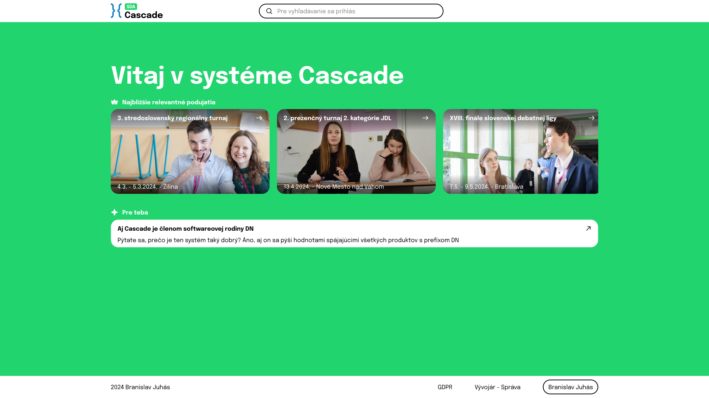
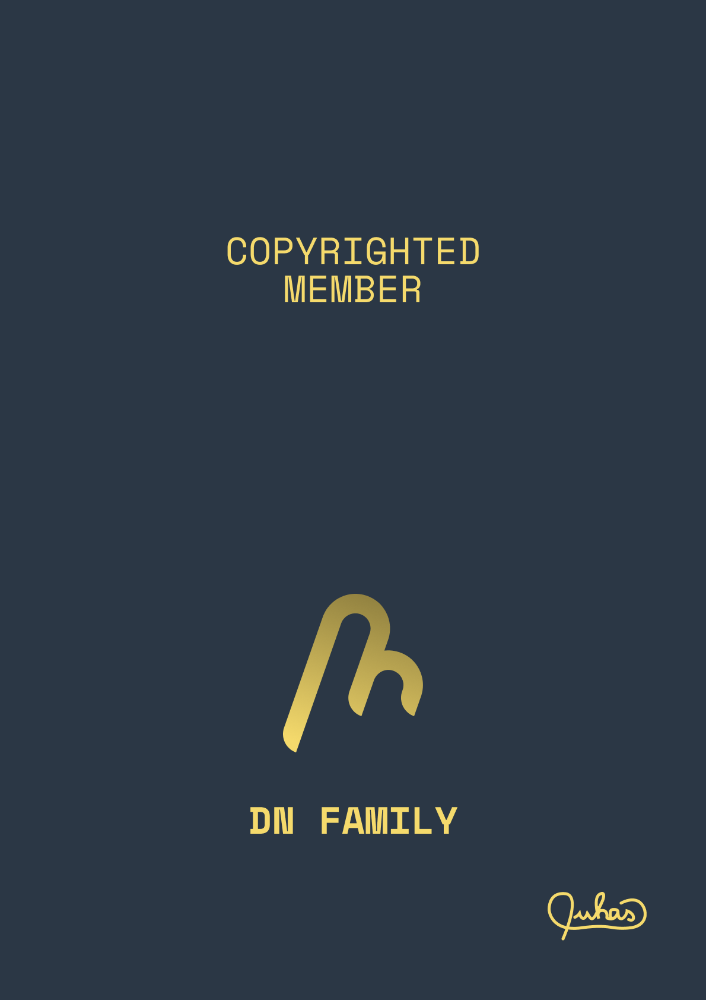

# DN Cascade
   

## Description

**DN Cascade | Barca | DebRIEF** is a comprehensive solution designed to cater to the needs of the SDA for data centralization. It is built with a focus on efficiency, scalability, and user experience. The project includes a wide range of features such as user authentication and data management, all tailored to provide a seamless experience for the users. The platform is robust, versatile, and built using the latest technologies to ensure its scalability and efficiency.

## Setup Instructions

1. Clone the repository to your local machine or download the source code form one of the releases.
2. Navigate to the project directory.
3. Install the necessary dependencies by running `npm install`.
4. Start the project by running `npm dev`.
5. The application should now be running on your local machine.

## Remarks

This project is a work in progress and is subject to changes. Feedback and contributions are welcome. Please ensure to follow the contribution guidelines when making any changes to the codebase.

## Licensing Declaration

The author originally intended to transfer the ownership of this software to the SDA. However, due to concerns regarding the direction and value shift of the organization, the author decided to maintain all rights to the software to prevent potential misuse of his work. The author has no intention of using his ownership to gain profit. Once the SDA is back on the right track, a transfer of ownership is planned. This decision was made to ensure that the software continues to serve its intended purpose and to protect the integrity of the project.

---

| Since May 9, 2024, the DN Henkel Vision project has proudly become a copyrighted member of the DN Family, meaning that it carries the [values and principles of the DN Family](https://dn.juhaas.eu). |  |
|-------------------------------------------------------------------------------------------------------------------------------------------------------------------------------------------------------|----------------------------------------------|