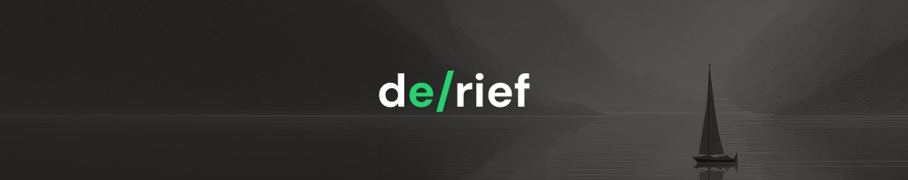

# DN DebRIEF




**DN DebRIEF** (DebRIEF II - Sunlake) is a modern debate platform for the community of the Slovak Debate Association (_Slovenská debatná asociácia_, SDA). It covers the full life cycle of debate activity — events and registrations, clubs and memberships, payments, methodology materials, and user records.

The application interface is in Slovak; the codebase and documentation are in English.

## Features

- **Events** — tournaments, workshops, and other events with rich-text descriptions, schedules, thumbnails, motions, and organizer management.
- **Registrations** — built-in or external forms with custom roles, fees, credential requirements, conditional questions, and deadlines. Includes legal-guardian confirmation for minors, registration management, and Excel export.
- **Clubs & memberships** — club registry with managers and season-based memberships.
- **Profiles** — credentials, awards, memberships, registrations, and payment history.
- **Payments** — Stripe Checkout, webhooks, and manual resolution/adjustment/waivers.
- **Methodology library** — rules and methodology documents with public and private S3 storage.
- **Administration** — role-aware dashboard (`/manage`) for users, clubs, events, content, and payments.
- **API** — documented OpenAPI with interactive docs at `/api/docs`.

## Built with

- **Frontend:** Nuxt 4, Vue 3, Nuxt UI v4, Tailwind CSS v4
- **Backend:** Nitro, PostgreSQL 18 + Drizzle ORM (embedded PGlite in development), Better-Auth
- **Integrations:** Stripe, AWS SES, S3-compatible storage (RustFS)
- **Tooling:** Vite+, TypeScript, Docker

## Quick start

Requires Node.js 26 and [Vite+](https://viteplus.dev) (`vp`):

```sh
cd web
vp install
vp run dev
```

The app runs at [http://localhost:3000](http://localhost:3000). Development uses an embedded database and local file storage, and emails are logged to the console — no external services are needed.

Full setup instructions, environment variables, scripts, and project structure are in [`web/README.md`](web/README.md).

## Deployment

The platform ships as a Docker image (`ghcr.io/branislavjuhaas/dn-debrief-web`). A `docker-compose.yml` runs the full local stack (PostgreSQL + RustFS storage), and `docker-compose.prod.yml` targets Dokploy. Publishing a release builds the image and deploys it automatically through GitHub Actions.

## Links

- [Contributing](CONTRIBUTING.md) · [AI contribution policy](AI_POLICY.md) · [Code of conduct](CODE_OF_CONDUCT.md) · [Security policy](SECURITY.md)
- [API documentation](web/README.md#api-documentation) · [Changelog](CHANGELOG.md)

## License

[GNU AGPL v3](LICENSE) © Branislav Juhás
